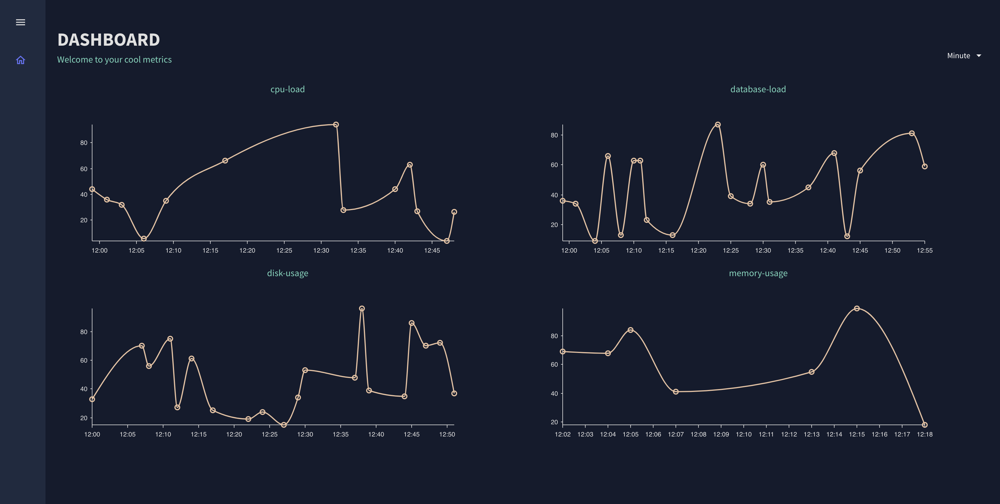

# Metrics Dashboard

`metrics-dashboard` is a small react application designed to show metrics in a timeline. The project uses `metrics-api` to be fetch the metrics data.





## Requirements

- **node** 
- **npm** 
- **metrics-api** 

## Getting Started

This project was bootstrapped with [Create React App](https://github.com/facebook/create-react-app).

### Setup

1. **Clone the repository**

    ```bash
    git clone https://github.com/beadn/CoolMetrics.git
    cd CoolMetrics/metrics-dashboard
    ```

1. **Installation**
    ```bash
    npm install
    ```
`npm install`  


### Running the Application

1. **Start server**

    See instructions in: `../metrics-api/README.md` 

    NOTE: The server should be running in: 

    `http://localhost:3000/` 

2. **Start the application**

    ```bash
    npm start 
    ```
3. **Visit App**

    `http://localhost:3001/` 

### Test APP
1. **Start Unit Tests**

    ```bash
    npm test
    ```
